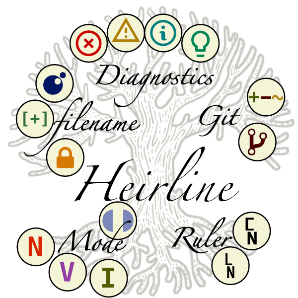

<p align="center">
  <h2 align="center">heirline.nvim</h2>
</p>
<p align="center">
  
</p>
<p align="center">The ultimate Neovim Statusline for tinkerers</p>

## About

Heirline.nvim is a no-nonsense Neovim plugin made for rendering statusline/winbar/tabline/statuscolumn format strings.
It is designed around recursive inheritance to be exceptionally **fast** and **versatile**.

Heirline **does not** provide any defaults, in fact, heirline can be
thought of as an API to generate Vim status format strings.

> **Why another statusline plugin?**

Heirline picks up from other popular customizable statusline plugins like
[galaxyline](https://github.com/NTBBloodbath/galaxyline.nvim) and
[feline](https://github.com/feline-nvim/feline.nvim) but removes all the
hard-coded guides and offers you thousands times more freedom. But freedom has a
price: responsibility. I don't get to tell you what your statusline should do.
You're in charge! With Heirline, you have a framework to easily implement
whatever you can imagine, from simple to complex rules!

<p align="center">
  
</p>

## Features:

- **Conditionals**: Build custom active/inactive and buftype/filetype/bufname statuslines or single components.
- **Highlight propagation**: Seamlessly surround components within separators and/or set the (dynamic) coloring of a bunch of components at once.
- **Modularity**: Statusline components can be reutilized/rearranged and will behave according to their position in the genealogical tree.
- **Update triggers**: Re-evaluate components only when some condition is met or specific autocommand events are fired.
- **Clickable**: Write pure lua callbacks to be executed when clicking a component.
- **Dynamic resizing**: Specify how components should resize depending on available space.
- **Full control**: You have hooks to fully control the statusline evaluation cycle.

Heirline is _not_ for everyone, heirline is for people who like tailoring their own tools (and also like lua):

- **No** default statusline is provided
- You **must** write your own statusline

But don't you worry! Along with the inheritance comes [THE FEATUREFUL COOKBOOK](cookbook.md) 📖
of a distant relative. Your dream 🪄 statusline is a
copypaste away!

## Installation

Use your favorite plugin manager

### Packer

```lua
use({
    "rebelot/heirline.nvim",
    -- You can optionally lazy-load heirline on UiEnter
    -- to make sure all required plugins and colorschemes are loaded before setup
    -- event = "UiEnter",
    config = function()
        require("heirline").setup({...})
    end
})
```

## Setup

```lua
require("heirline").setup({
    statusline = {...},
    winbar = {...},
    tabline = {...},
    statuscolumn = {...},
})
```

Calling `setup` will load your statusline(s). To learn how to write a StatusLine, see the [docs](cookbook.md).

### Donate

Buy me coffee and support my work ;)

[](https://www.paypal.com/donate/?business=VNQPHGW4JEM3S&no_recurring=0&item_name=Buy+me+coffee+and+support+my+work+%3B%29&currency_code=EUR)
